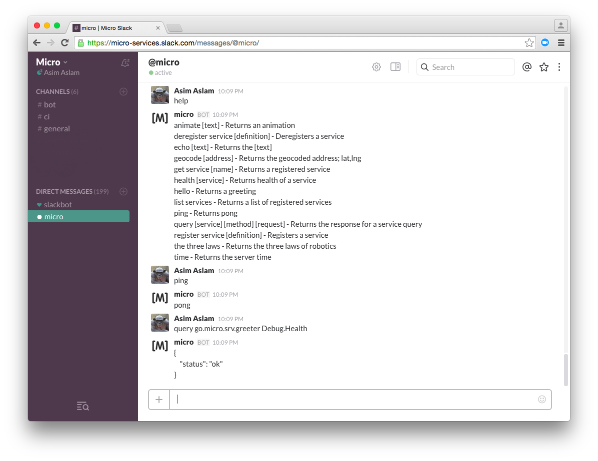
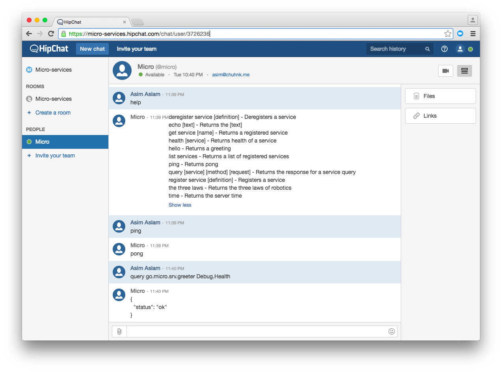

# 微型机器人
微型机器人是一个位于微服务环境中的机器人，您可以通过Slack，HipChat，XMPP等进行交互。它通过消息传递模拟CLI的功能。


## 支持的输入
- Slack
- HipChat

## 入门

### 安装Micro

```
go get github.com/micro/micro
```

### 用Slack运行

```
micro bot --inputs=slack --slack_token=SLACK_TOKEN
```




### 用HipChat运行

```
micro bot --inputs=hipchat --hipchat_username=XMPP_USER --hipchat_password=XMPP_PASSWORD
```



通过使用逗号分隔列表来指定多个输入

```
micro bot --inputs=hipchat,slack --slack_token=SLACK_TOKEN --hipchat_username=XMPP_USER --hipchat_password=XMPP_PASSWORD
```

### 帮助
在slack中


```
micro help

deregister service [definition] - Deregisters a service
echo [text] - Returns the [text]
get service [name] - Returns a registered service
health [service] - Returns health of a service
hello - Returns a greeting
list services - Returns a list of registered services
ping - Returns pong
query [service] [method] [request] - Returns the response for a service query
register service [definition] - Registers a service
the three laws - Returns the three laws of robotics
time - Returns the server time
```

## 添加新的命令

由机器人执行的命令和功能是基于文本的匹配模式。

### 写一个命令

```
import "github.com/micro/go-bot/command"

func Ping() command.Command {
	usage := "ping"
	description := "Returns pong"

	return command.NewCommand("ping", usage, desc, func(args ...string) ([]byte, error) {
		return []byte("pong"), nil
	})
}
Registe
```

### 注册该命令
使用可以通过`golang/regexp.Match`匹配的模式键将命令添加到Commands映射表。

```
import "github.com/micro/go-bot/command"

func init() {
	command.Commands["^ping$"] = Ping()
}
```

### 重新构建Micro
构建二进制

```
cd github.com/micro/micro

// For local use
go build -i -o micro ./main.go

// For docker image
CGO_ENABLED=0 GOOS=linux go build -a -installsuffix cgo -ldflags '-w' -i -o micro ./main.go
```

## 添加新的输入
输入是用于通信的插件，例如Slack，HipChat，XMPP，IRC，SMTP等等。

可以通过以下方式添加新的输入。

### 编写一个输入
编写满足输入接口的输入。

```
type Input interface {
	// Provide cli flags
	Flags() []cli.Flag
	// Initialise input using cli context
	Init(*cli.Context) error
	// Stream events from the input
	Stream() (Conn, error)
	// Start the input
	Start() error
	// Stop the input
	Stop() error
	// name of the input
	String() string
}
```

### 注册输入
将输入添加到输入映射。

```
import "github.com/micro/go-bot/input"

func init() {
	input.Inputs["name"] = MyInput
}
```

### 重新构建Micro
构建二进制

```
cd github.com/micro/micro

// For local use
go build -i -o micro ./main.go

// For docker image
CGO_ENABLED=0 GOOS=linux go build -a -installsuffix cgo -ldflags '-w' -i -o micro ./main.go
```

## 作为服务的命令
微型机器人支持作为微服务创建命令的能力。

### 它是如何工作的？
机器人使用它的命名空间监视服务注册中心的服务。默认名称空间是`go.micro.bot`。该名称空间内的任何服务都将自动添加到可用命令列表中。执行命令时，机器人将使用`Command.Exec`方法调用该服务。它也希望方法`Command.Help`存在于使用信息中。

服务接口如下，可以在[go-bot/proto](https://github.com/micro/go-bot/blob/master/proto/bot.proto)中找到。

```
syntax = "proto3";

package go.micro.bot;

service Command {
	rpc Help(HelpRequest) returns (HelpResponse) {};
	rpc Exec(ExecRequest) returns (ExecResponse) {};
}

message HelpRequest {
}

message HelpResponse {
	string usage = 1;
	string description = 2;
}

message ExecRequest {
	repeated string args = 1;
}

message ExecResponse {
	bytes result = 1;
	string error = 2;
}
```

### 示例
这里有一个echo命令作为微服务的示例。

```
package main

import (
	"fmt"
	"strings"

	"github.com/micro/go-micro"
	"golang.org/x/net/context"

	proto "github.com/micro/go-bot/proto"
)

type Command struct{}

// Help returns the command usage
func (c *Command) Help(ctx context.Context, req *proto.HelpRequest, rsp *proto.HelpResponse) error {
	// Usage should include the name of the command
	rsp.Usage = "echo"
	rsp.Description = "This is an example bot command as a micro service which echos the message"
	return nil
}

// Exec executes the command
func (c *Command) Exec(ctx context.Context, req *proto.ExecRequest, rsp *proto.ExecResponse) error {
	rsp.Result = []byte(strings.Join(req.Args, " "))
	// rsp.Error could be set to return an error instead
	// the function error would only be used for service level issues
	return nil
}

func main() {
	service := micro.NewService(
		micro.Name("go.micro.bot.echo"),
	)

	service.Init()

	proto.RegisterCommandHandler(service.Server(), new(Command))

	if err := service.Run(); err != nil {
		fmt.Println(err)
	}
}
```
