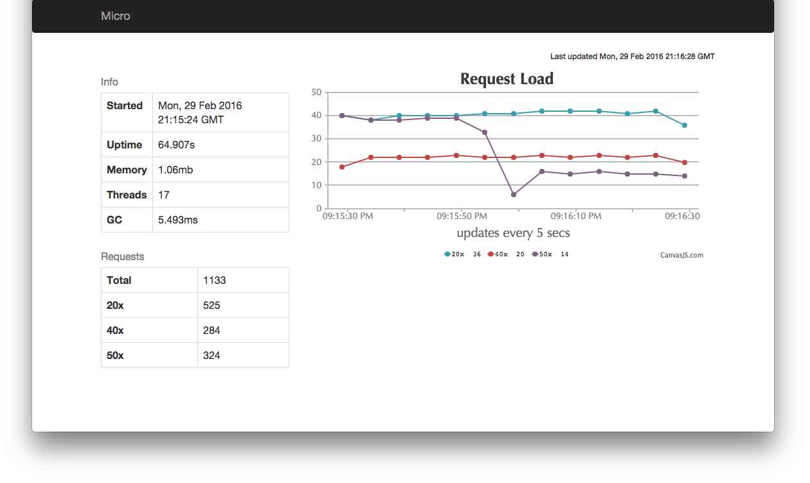
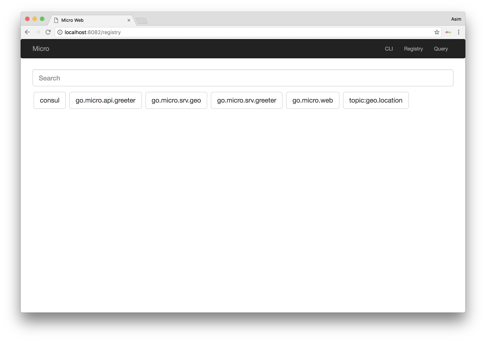
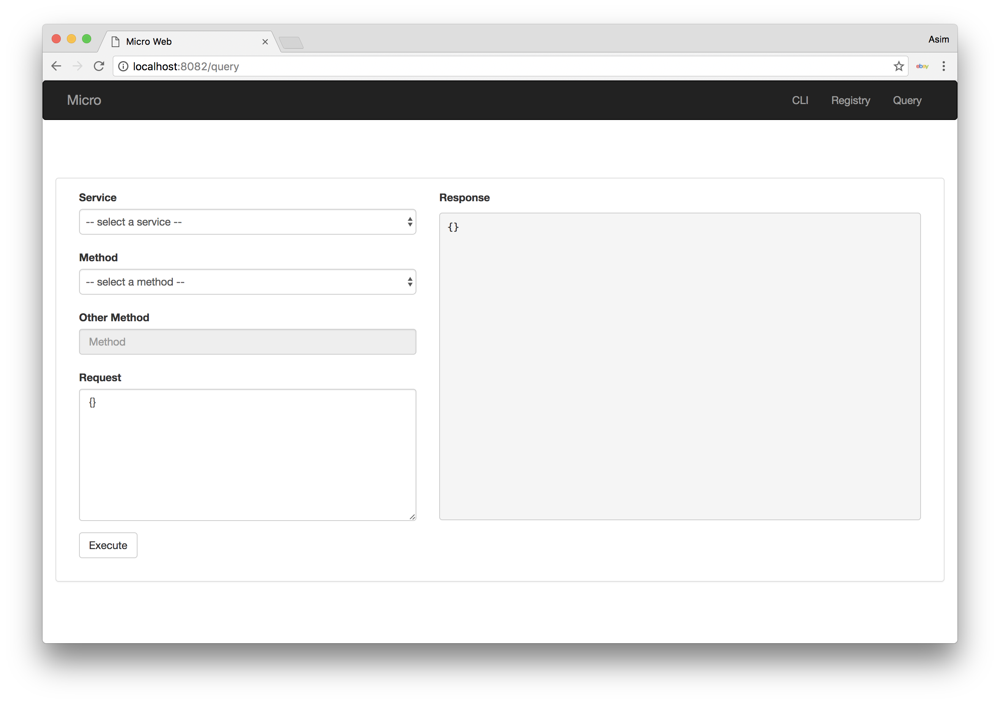
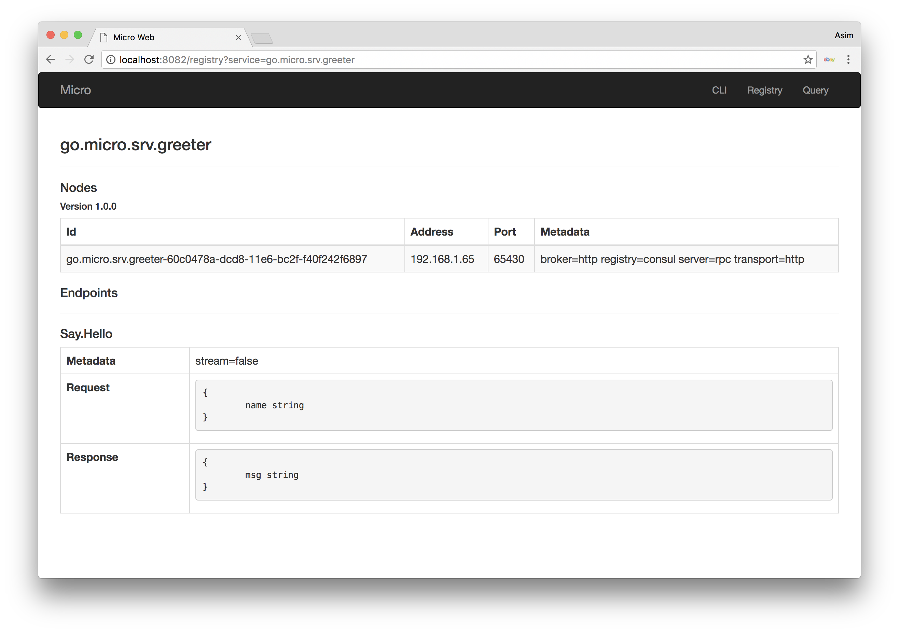
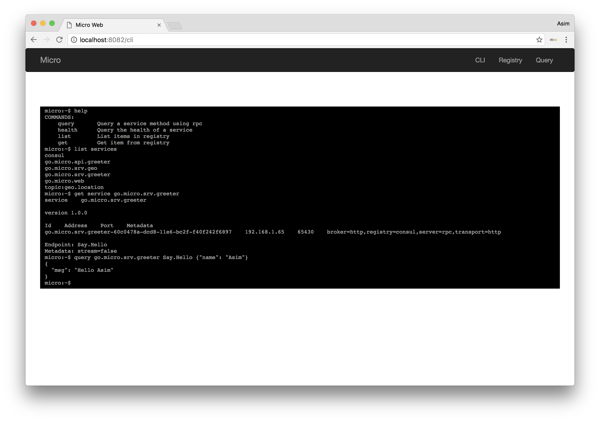

# Micro Web
Micro Web提供了一个用于查看和查询服务的仪表板，以及一个用于为Micro Web应用程序提供服务的反向代理。我们相信web应用程序是微服务世界中的一等公民。


## API

```
- / (UI)
- /[service]
- /rpc
```

## 特性

|Feature|Description|
|---|---|
|UI   |用于查看和查询正在运行的服务的仪表板|
|Proxy|Micro Web服务的反向代理（包括websocket支持）|

### Proxy

Micro Web为网络应用程序提供内置的HTTP反向代理。这基本上允许您将Web应用程序视为微服务环境中的一等公民。代理将使用`/[service]`以及命名空间（默认：go.micro.web）在服务发现中查找服务。它将服务名称组成为`[namespace].[name]`。

该代理将从请求中除去`/[service]`，并将URL路径的其余部分转发给Web应用程序。它还会将头部”X-Micro-Web-Base-Path”设置为已删除的路径，因此您需要使用它才能构建URL等某种原因。

示例翻译

|Path|Service|Service Path|Header: X-Micro-Web-Base-Path|
|---|---|---|---|
|/foo    |go.micro.web.foo|/   |/foo|
|/foo/bar|go.micro.web.foo|/bar|/foo|

*注意：Web代理使用HTTP请求服务。没有其他传输能力。*


## 入门

### 安装

```
go get github.com/micro/micro
```

### 运行Web UI/Proxy

```
micro web
```

通过浏览器访问`localhost:8082`

### 通过ACME使能加密
通过ACME提供默认安全服务

```
micro --enable_acme web
```

可以指定一个主机白名单

```
micro --enable_acme --acme_hosts=example.com,web.example.com web
```

### 提供TLS安全
Web代理支持使用TLS证书提供安全服务

```
micro --enable_tls --tls_cert_file=/path/to/cert --tls_key_file=/path/to/key web
```

### 设置命名空间

Web默认服务名称空间为**go.micro.web**。名称空间和请求路径的组合用于解析服务以反向代理。

```
micro web --namespace=com.example.web
```

## 统计
您可以通过`--enable_stats`标志启用统计信息显示板。它将暴露在`/stats`上。

```
micro --enable_stats web
```



## 截图








