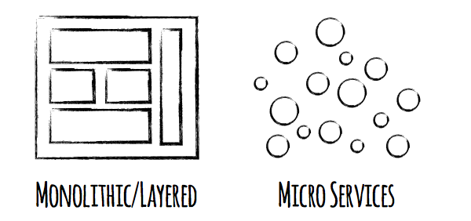

# 微服务

我们来谈谈软件开发的未来。

变化正在进行中。我们正在越来越多地走向每个企业核心技术驱动的世界。在这个时代保持竞争优势变得困难。当企业试图通过低效的平台，流程和结构进行扩展时，组织的执行能力可能会停滞不前。十年前的技术公司已经经历了这些伸缩的痛苦，大多数已经使用相同的方法来克服这些挑战。

是时候把世界上最成功的公司的竞争优势带给其他人了。所以，我们来谈谈微服务，这是一种创造竞争优势的方式。

## 什么是微服务？

微服务是一种软件架构模式，用于将大型整体应用程序分解为更小的可管理独立服务，这些独立服务通过跨语言的协议进行通信，每个服务都专注于做好一件事情。

来自行业专家的微服务的定义。

1. 松散耦合的面向服务的体系结构 
Adrian Cockcroft

2. 一种将单个应用程序开发为一套小型服务的方法，每个小型服务都运行在自己的进程中，并与轻量级机制进行通信 
Martin Fowler

微服务的概念并不新鲜，这是对面向服务的体系结构的重新构想，而是采用了一种更加全面的方式与unix进程和管道对齐的方法。

微服务架构的理念：

- 这些服务是小的 - 作为一个单一的商业目的的细粒度，类似unix哲学的“做一件事，做得好”
- 组织文化应该包含部署和测试的自动化。这减轻了管理和运营的负担。
- 文化和设计原则应该包含失败和错误，类似于抗脆弱的系统。

## 为什么需要微服务？

随着组织规模技术和人数的增长，管理单一代码库变得更加困难。我们都已经习惯了在一段时间内整个Twitter失败，因为他们试图用一个单一的系统来扩展他们的用户群和产品功能集。微服务使Twitter可以将他们的应用程序分解成更小的服务，这些服务可以由许多不同的团队分别管理。每个团队负责由许多可独立于其他团队部署的微服务组成的业务功能。

我们已经看到了第一手的经验，微服务系统可以缩短开发周期，提高生产力和优越的可扩展系统。

我们来谈谈一些好处：

1. **更容易扩展开发** - 团队围绕不同的业务需求组织管理自己的服务。
2. **更容易理解** - 微服务要小得多，通常为1000 LOC或更少。
3. **更容易频繁地部署新版本的服务** - 可以部署，缩放和独立管理服务。
4. **改进的容错和隔离** - 关注分离可以最大限度地减少一个服务中的问题对另一个服务的影响。
5. **提高执行速度** - 团队通过独立开发，部署和管理微服务来更快地实现业务需求。
6. **可重复使用的服务和快速原型** - 微服务中的unix理念使您能够重用现有服务，并更快地构建全新的功能。

## 什么是Micro？

Micro是一个微服务生态系统，致力于提供产品，服务和解决方案，以实现现代软件驱动型企业的创新。我们计划成为任何与微服务相关的事实资源，并期待公司能够利用这项技术为自己的业务。从早期的原型开始一直到大规模的生产部署。

我们已经看到行业发生根本性转变。摩尔定律是有效的，我们每天都能获得越来越多的计算能力。但是，我们无法完全获取这种新的能力。现有的工具和开发实践在这个新时代并没有scale。没有提供开发人员从单一代码库转向更高效的设计模式的工具。大多数公司不可避免地以单一设计达到收益递减，必须进行大规模的研发再造。 Netfix，Twitter，Gilt和Hailo都是最好的例子。所有最终都建立了自己的微服务平台。

我们的愿景是提供基本的构建模块，使任何人都可以轻松采用微服务。